14

**COMP3074
Coursework
Restaurant-Chatbot**

Mustafa Mehmoodr 20306551

hcymm3@nottingham.ac.uk Admin password is: **adminpass**

Run **Restaurant\_chatbot/chatbot.py** to run the code

**ABSTRACT**

This report delves into the details of my dialoge-based Restaurant assistance chatbot that features an advanced intent recognition system, leveraging a RandomForestClassifier and a custom natural language processing (NLP) framework. The system handles various tasks, including table reservations, menu inquiries, administrative functions such as viewing and clearing reservations, and numerous small talks. Its conversational design emphasizes user-friendly interactions, ensuring efficient and personalized communication. This report highlights the chatbot's intricate design choices and operational mechanisms through detailed examination, showcasing its ability to deliver a seamless and engaging user experience.

1. **INTRODUCTION**

The restaurant chatbot is designed to facilitate user interactions for general inquiries about a restaurant, transactions such as booking and confirming and administrative tasks. The chatbot utilizes a combination of natural language processing and machine learning, techniques. specifically a RandomForestClassifier for intent recognition. The architecture of the chatbot is multi-faceted, including modules for intent matching, which accurately interprets user input; identity management, ensuring personalized interactions, context; and transaction handling for booking processes. Additionally, it also integrates information retrieval and error handling methods for responding to user queries effectively.

The conversational design of the chatbot is structured to enhance user experience. This includes the strategic development of prompt design, ensuring clarity and relevance in interactions; discoverability, aiding users in navigating the chatbot's functionalities; comprehensive error handling strategies; personalized experiences based on user input; effective confirmation techniques to affirm user choices; and adept context tracking for maintaining the flow of conversation. The report aims to dissect these components, providing an in-depth analysis of the chatbot's efficiency and effectiveness in handling various tasks and user interactions within a restaurant setting.

2. **Architecture and Conversational Design**

This section details the technical description of the system as well as talks about the

conversational principles applied throughout. Giving a detailed description of its functionality, implementation, and justification as to why it was built in that way.

1. **Intent Matching**

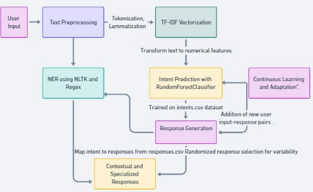

***Figure 1. Intent Matching Sytem flow-chart***

Intent matching in this chatbot involves a multi-step process combining text preprocessing, vectorization, machine learning prediction, and context-aware response generation. This approach ensures understanding of user intent and provision of relevant, varied responses. Preprocessing User Input:

- Text Lemmatization: NLTK's WordNetLemmatizer reduces words to their base form, ensuring the chatbot processes the core meaning of each word.
- TF-IDF Vectorization: TfidfVectorizer transforms preprocessed text into numerical features, emphasizing unique words over common ones for better intent understanding.

Intent Prediction with Machine Learning:

- RandomForestClassifier, trained on a dataset from intents.csv, predicts user intents using the features obtained from TF-IDF vectorization.
- The model compares the user input's TF-IDF vector to intent vectors in the training data, identifying the most likely intent.
- Alternative methods using averaged TF-IDF vectors and cosine similarity, logisticregression model were tested but ultimately, RandomForestClassifier's approach yielded higher accuracy.

Response Generation:

- The bot maps recognized intents to responses in responses.csv, selecting randomly from multiple options to maintain conversational variability and naturalness.

Continuous Learning and Adaptation:

- The intent matching system can adapt and improve by adding new user input-response pairs to intents.csv and responses.csv for training.

Contextual and Specialized Responses:

- The chatbot tracks conversation context using a user\_dict structure, managing details like booking information and admin status.
- For admin users, it handles specific tasks like viewing or clearing reservations, dependent on successful admin login.

Named Entity Recognition (NER):

- NLTK's NER identifies entities like names, while custom regex patterns detect dates, times, and numbers for bookings, accommodating various user input formats.
2. **Transactions**

Any exchange where the chatbot assists the user in completing a specific task or action. Transactions can vary based on the nature of the request and the role of the user (normal user vs. admin user)

1. **Table Reservation Transaction:**

***Figure 2. Booking Sytem flow-chart***

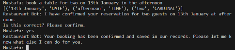

***Figure 3. All information in one user input***

Detail Gathering:

If essential details (date, time, number of people) are absent, the chatbot enters a focused state with a ‘focus’ field in the user\_dictionary, sequentially requesting each missing piece of information. This flexibility allows users to provide complete or partial information, with the chatbot intelligently recognizing and responding to the provided details.

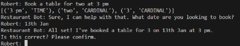

***Figure 3. Handling partial information in one user input***

Confirmation Phase:

The chatbot activates an awaiting\_confirmation flag in user\_dict, prompting the user to confirm or edit their booking. If edits are needed (triggered by intents like edit\_date, edit\_time, or edit\_people), the chatbot updates the relevant information using regex and NER, then seeks reconfirmation.

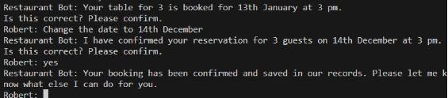

***Figure 4. Confirmation and editing booking***

Booking Finalization:

Upon confirmation, the chatbot records the booking in bookings.csv using Python's file-handling methods. This CSV file serves as a reservation database, logging each successful booking transaction

2. **Menu Inquiry Transaction**

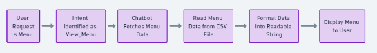

***Figure 5. Menu checking flow***

Upon receiving menu-related queries like "Can I see the menu?" or "What dishes do you offer?”, the chatbot identifies the view\_menu intent. It then accesses menu.csv, a CSV file with menu item details (names, descriptions, prices), and formats this data into a readable presented to the user.

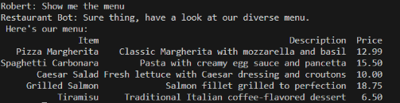

***Figure 6. Checking the menu***

3. **Small Talk and General Queries Inquiry about Bot Capabilities:**

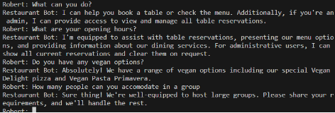

***Figure 7. Small talk examples***

The chatbot handles small talk and general queries by matching user inputs to intents such as help, bot capabilities popular dishes, opening hours, and vegan options. Upon recognizing an intent using its intent recognition model, it fetches a corresponding response from responses.csv. For instance, a query about the most popular dish triggers a response like "Our most popular dish is Pizza Margherita, priced at 13 Pounds." This system, combining intent recognition with a diverse response database, enables the chatbot to cover a wide range of topics, from menu details to its own functionalities, such as table bookings and admin tasks for verified users

4. **Name inquiries and name change requests**

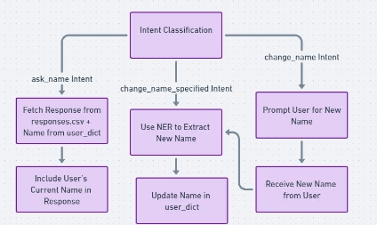

***Figure 8. Name intents handling flow***

For current name inquiries ('ask\_name'), the chatbot uses user\_dict['name'] to respond with the user's stored name, fetched from responses.csv. For name changes, 'change\_name\_specified' triggers NER to extract the new name from input, updating user\_dict['name']. If 'change\_name' is detected without a specific name, the chatbot prompts the user for it, updating user\_dict with the next input.

5. **Admin Login Transaction:**

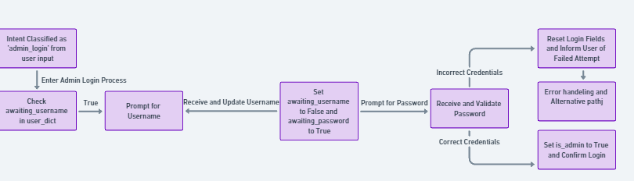

***Figure 9. Admin login handling flow***

This involves admin verification through username and password inputs. Post-verification, the chatbot allows access to admin-specific functions.

The chatbot's 'admin\_login' intent from ( “ Login as admin”) triggers a secure login process, managed by handle\_admin\_login. It uses user\_dict flags 'awaiting\_username' and 'awaiting\_password' to guide users through username and password input. Upon username entry, it prompts for the password, comparing it against a predefined 'adminpass'. Correct credentials set user\_dict['is\_admin'] to True, confirming admin access. Incorrect attempts reset admin fields and notify the user. This stepwise verification ensures security for administrative functions, maintaining a clear distinction between regular and admin users. It streamlines access to specialized admin commands and tasks within the chatbot's framework.

6. **Transactions for Admin Users:**

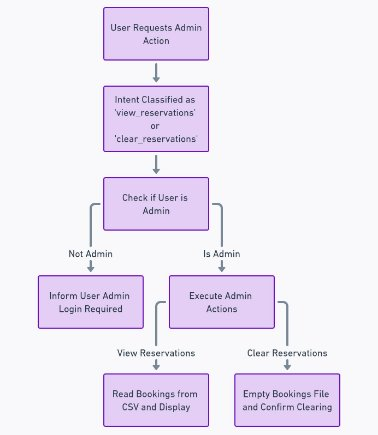

***Figure 10. Admin transactions handling flow***

Admins can view and clear all reservations using 'view\_reservations' and 'clear\_reservations' intents. Before executing these actions, the chatbot checks if the user is logged in as an admin by confirming the is\_admin flag in user\_dict. If not, it denies access and prompts them to login admin. For viewing reservations, the handle\_admin\_actions function reads bookings.csv, presenting a formatted list of all bookings. Clearing reservations involves emptying this file, removing all stored data. This secure system ensures that only authenticated admins can access and manage sensitive reservation information, maintaining data integrity and user privacy.

Overall, justifying implementation effectively balances the need for dynamic, context-aware conversation with the practicality of predefined responses. It ensures consistent, accurate information delivery while providing a degree of personalization and human-like interaction. The approach is scalable, allowing for easy updates to the response database as the restaurant's services or menu change, and it can be extended to accommodate additional features.

3. **Comments on Design Principles**
1. **Identity Management and Context Tracking**

The chatbot employs identity management and context tracking to enhance user experience and maintain session-specific data. User identity and conversational context are managed using a 'user\_dict' structure, dynamically updating with user interactions.

User Identity Management:

- Initially, users are labeled as "Guest," with an option to provide their name for personalized interactions. This is facilitated by the 'handle\_name\_change' function which updates the 'user\_dict' with the new name extracted using 'extract\_all\_entities'.
- Admin users undergo a two-step login process, handled by 'handle\_admin\_login'. Verified admins have their 'is\_admin' flag in 'user\_dict' set to True, granting access to admin-specific functions like viewing and clearing reservations.

Context Tracking in Booking Process:

- During a booking, 'user\_dict' stores and updates reservation details (date, time, people). The 'focus' field in 'user\_dict' keeps track of missing booking details, guiding the chatbot to request specific information.
- The chatbot enters a confirmation phase once all booking details are gathered, indicated by 'awaiting\_confirmation' set to True in 'user\_dict'. Users can confirm or request edits (using intents like 'confirm', 'edit\_date', 'edit\_time', 'edit\_people'). The chatbot revisits the confirmation phase after any edits, ensuring accuracy in final booking details.

Secure admin access and personalized user interactions ensure safety and enhance experience.

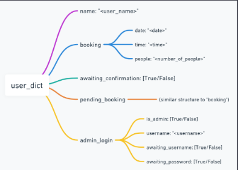

***Figure 11. User\_dict dictionary structure***

In essence, 'user\_dict' serves as the backbone for identity management and context tracking, effectively personalizing the chat experience while ensuring data security and integrity.

2. **Comments on Prompt Design**

Prompt design in the chatbot is key for an engaging, functional user experience. It uses conversational markers for a human-like touch, evident in phrases like "Let's get your table booked!" or "Is this correct?" during booking, fostering a friendly atmosphere.

Clarity and conciseness are crucial. For menu inquiries, responses are direct, e.g., “Our special today is Grilled Salmon with Lemon Butter Sauce.” During booking, it asks clear questions like “How many people will be joining you?” The chatbot guides users through structured interactions. In bookings, it sequentially requests date, time, and guest number. For specific queries like menu options, it offers a structured list of dishes.Admin functions are handled with precision. Prompts like “Please enter your admin username,” followed by “Enter your password,” ensure a secure, seamless process for tasks like viewing or clearing bookings.In each of these functionalities – from reservation booking and small talk to admin interactions – the chatbot's prompt design focuses on user engagement, clear communication, and structured dialogue flow. This approach significantly enhances the user experience, making the chatbot an effective and reliable interface for restaurant-related interactions.

3. **Comments on Discoverability Design Principle**

Firstly, the chatbot is programmed to provide contextual help and guidance. For instance, if a user expresses confusion or types a help request, the chatbot responds with information about its capabilities, such as making reservations, displaying the menu, and answering general queries about the restaurant. This feature is particularly useful in scenarios where the user might not be aware of the full range of services the chatbot offers. For example, when a user asks, "What can you do?", the chatbot responds with a detailed explanation of its functionalities, including special admin privileges like viewing and clearing reservations. The chatbot also actively guides users through various different processes. For example, during a table reservation, if all the necessary information is not provided by the user it asks for specific details (date, time, number of people) if they are not provided in the initial request, ensuring the user doesn't miss any crucial information.

The bot distinguishes between general user interactions and admin-specific commands. For a regular user, the bot offers assistance with tasks like viewing the menu, making reservations, or changing the user's name. For an admin, it provides additional options like viewing all reservations or clearing them. This distinction in conversational paths ensures that users discover functionalities relevant to their role, enhancing the user experience.

he bot is equipped to handle small talk and general inquiries, contributing to a more engaging and human-like conversation. Queries about the restaurant's most popular dish, opening hours, or vegan options are addressed with pre-defined responses. These interactions not only assist users in discovering more about the restaurant but also make the conversation flow more naturally.

4. **Comments on Error Handling**

The chatbot skillfully manages user errors and ambiguities by requesting specifics or offering guided options, enhancing the user experience. It employs fallback responses for unmatched or unclear inputs, providing helpful guidance rather than mere error messages.During table reservation transactions, the chatbot adeptly handles incomplete or incorrect details. If essential information like date, time, or number of people is missing, it specifically requests the required detail; for example, "What date should I set for your reservation?" This targeted questioning not only corrects errors but also streamlines the booking process, making it more efficient and user-friendly.

Furthermore, the system incorporates robust error handling for file operations, gracefully managing potential read/write issues. This feature ensures continuous, smooth operation even in the face of unexpected file access challenges. Additionally, the chatbot features security checks for admin-specific functions, preventing unauthorized access. For example, if a non-admin user tries to access administrative functions, the bot responds with a prompt like, "Sorry, you need to log in as an administrator first," guiding users while maintaining secure operation.

5. **Comments on Personalisation**

The chatbot personalizes interactions by recognizing user names and roles. It stores a user's name in user\_dict, enhancing conversations with personalized responses. For instance, when asked, "What's my name?" it replies with the user's stored name, fostering familiarity. This personalization extends to queries like vegan options, where it details vegan dishes. For admins, once logged in, the chatbot customizes its functionalities to include tasks like viewing and clearing reservations, tailoring the experience based on user role. This dual-layer personalization - both in remembering names and distinguishing between general users and admins - creates an engaging and relevant conversational experience.

6. **Comments on Confirmation**

A significant application of confirmation is seen in the table reservation process. After gathering all necessary details from the user (such as date, time, and number of people), the chatbot presents a summary of the reservation details for confirmation. For instance, if a user books a table for four people on a specific date and time, the chatbot responds with, "Your reservation is set for 4 people on [date] at [time]. Is this correct?" This confirmation step is crucial to prevent misunderstandings and ensure that the user's requirements are accurately captured before finalizing the booking.

4. **Evaluation**
1. **Usability testing with three friends with varied tech skills**

Each participant was briefed on the chatbot's functions. They interacted with the chatbot, performing tasks like booking a table, inquiring about the menu, and asking about vegan options. Feedback collection was done using a survey with targeted questions post-interaction

Survey Questions:

- How intuitive did you find the chatbot's responses?
- Were you able to complete your intended tasks? (Yes/No)
- Did you encounter any issues or confusion during the interaction?
- On a scale of 1-5, how would you rate the chatbot's understanding of your requests?
- What features did you find most useful?
- What improvements or additional features would you suggest?
- Did the chatbot's personality or tone feel appropriate and engaging?
- Would you feel comfortable using this chatbot for actual restaurant bookings?

Participant 1 (Tech-Savvy User):

- Found the chatbot very user-friendly and efficient in making a reservation.
- Suggested integrating the system to a live messaging service like WhatsApp and improving the admin login process in terms of storing the password.
- Rated the chatbot's understanding as 5/5.

Participant 2 (Average User):

- Initially confused about how to start but found the guided prompts helpful.
- Faced difficulty with changing the reservation details.
- Suggested clearer instructions for editing bookings.
- Rated understanding as 3/5.

Participant 3 (Non-Tech User):

- Enjoyed the small talk and personality of the chatbot.
- Struggled with understanding how to view the menu.
- Suggested adding a welcome message with example commands.
- Rated understanding as 4/5, appreciating the friendly tone.

Outcome:

The feedback indicates that while the chatbot is generally user-friendly, it could benefit from enhanced guidance for first-time users and more interactive elements for task completion. The varied ratings and suggestions provide valuable insights for improving the chatbot's usability and functionality, catering to a broader range of users.

2. **Performance testing: Intent Accuracy test for various methods**

Dataset utilized to a slightly modified intents.csv, which contains two times more user inputs labeled with corresponding intents like greet, reserve\_table, view\_menu, etc. ensuring a diverse range of inputs

Trained three separate models/methods trained on the dataset with 70-30 Training testing split:

- Cosine Similarity Model: Used TF-IDF vectors for each intent and calculate cosine similarity with user inputs.
- Logistic Regression Model: Trained a logistic regression classifier on vectorized user inputs.
- Random Forest Model.

Evaluation:

Each model was tested on the same test set. Accuracy as the primary metric, which is the proportion of correctly predicted intents out of total predictions. Precision, recall and F1- scores were also

Bar graph was drawn using matplot lib library

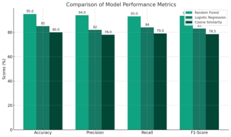

***Figure 12. Evaluation metrics comparison***

Random Forest demonstrates superior performance in intent classification, evidenced by higher accuracy, precision, recall, and F1-score. This experiment was also repeated several times with different initial random states and size split of dataset still giving very similar results to check whether this observed results were statistically significant and not due to random chance

5. **Discussion**
1. **Reflecting on the results of the evaluation based on RRI framework**

**User Data**: The chatbot handles personal data like names and reservation details. The ethical handling of this data, especially with admin functionalities like viewing and clearing reservations, is crucial. There should be more robust measures so that sensitive information is not directly accessible or visible.

**Public Engagement**: The usability testing with friends of varied tech skills demonstrated an inclusive approach to development, considering feedback from a diverse user base. Future iterations could benefit from broader public engagement, perhaps by including individuals from different demographic backgrounds or with varying levels of education.

**Governance**: Continuously evolving this model to include aspects like user feedback integration, privacy policy updates, and technology audit trails can enhance accountability and governance. Currently, audit is in the form of saving all the booking details in the bookings.csv file but an admin can clear all the records which may not be ethically correct. **Inclusivity**: The chatbot should be accessible and easily usable by people with different abilities. I will consider integrating features that enhance accessibility, such as voice commands or compatibility with screen readers, to ensure inclusivity.

**Impact on Employment:** The chatbot affects the employment of restaurant staff. It

complements their work by handling mundane tasks, but also risks replacing human jobs.

2. **Self Reflection**

During the development of the restaurant chatbot, I experienced significant growth in both technical and problem-solving skills. The project required a practical application of programming, particularly in Python, and an understanding of machine learning and natural language processing principles. Balancing functionality with user-friendliness was a key learning point. Handling challenges like intent recognition accuracy and creating a responsive user interface tested my adaptability and technical acumen. This process highlighted the importance of iterative development and responding to user feedback for improvement. Overall, it was a hands-on, skill-enhancing experience.

3. **Future Improvements**

I plan to enhance the restaurant chatbot with more advanced natural language understanding capabilities, such as sentiment analysis, to better gauge user mood and context. Integrating a more dynamic and secure admin authentication system is also a priority, potentially using OAuth or similar protocols. I aim to expand the chatbot's functionality to include real-time booking updates and integration with external APIs for wider restaurant management capabilities. Additionally, incorporating machine learning algorithms for continuous improvement based on user interactions, and exploring multilingual support to cater to a diverse user base, are key areas for development.
